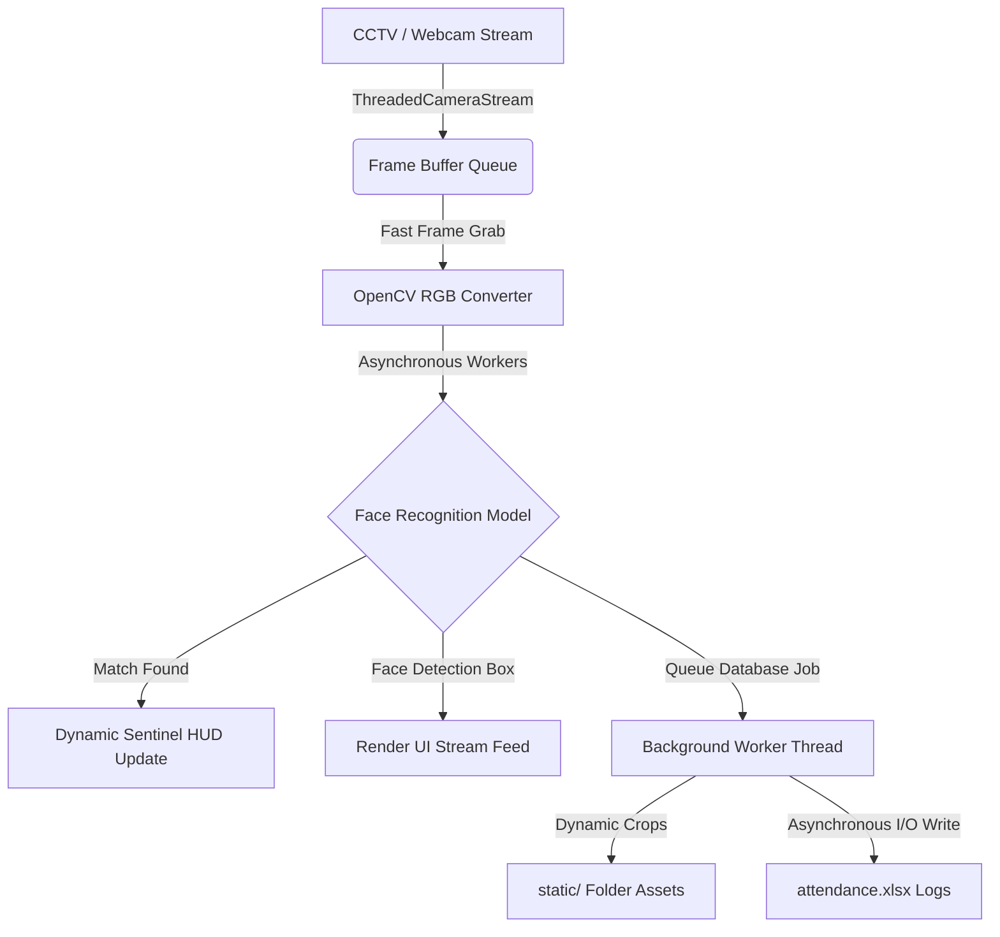

# 🛡️ AI Surveillance & Attendance System

A premium, recruiter-ready real-time facial recognition surveillance command terminal and automatic attendance management system. This application is built with a modern, high-performance threaded Python backend and a futuristic slate-glassmorphic HUD command center interface.

---

## 💎 Key Features

* **Futuristic Command Terminal Interface:** A fluid, responsive dark slate-blue dashboard (`#090D16`) using CSS-glassmorphic HUD cards, glowing neon status indicators, dynamic standby radar sweeps, and real-time frontend search filters.
* **Threaded Video Stream Architecture:** Features a custom, decoupled asynchronous frame-grabbing capture stream (`ThreadedCameraStream`) to deliver zero-lag, instant 30fps frames directly to facial recognition workers.
* **Sub-100ms Face Matching:** Leverages deep learning models via `face-recognition` and `dlib` to detect, crop, and match faces in real time against dynamically registered employee records.
* **Zero-Lock Database Queue:** Utilizes a background `queue.Queue` worker thread to execute face cropping and Excel spreadsheet logs asynchronously without ever locking or stuttering the main UI video stream.
* **Fresh Excel Attendance Logger:** Automatically instantiates a fresh, clean Microsoft Excel spreadsheet (`attendance.xlsx`) on launch with two structured sheets:
  * **`Log`:** Tracks all face recognition timestamp logs (`Name`, `Date`, `Time`).
  * **`Attendance`:** Records unique daily check-ins (`Name`, `Date`, `First Seen Time`) to prevent duplicate attendance logs.
* **Dynamic Stream Linking:** Features a live, interactive connection bar in the dashboard to dynamically switch between local webcams and external CCTV IP-camera streams (e.g. RTSP or HTTP streams) in real time.
* **Secure One-Click Portfolio Deployer:** Equipped with a local-only `run_portfolio.bat` helper script that bootstraps the server and initiates a secure, free public HTTPS Ngrok tunnel—allowing recruiters to test your local face-recognition server with their own webcams from anywhere in the world.

---

## ⚙️ System Architecture



---

## 🛠️ Technology Stack

* **Backend Engine:** Python 3.10+, Flask, OpenCV (`opencv-python`), Deep Learning Face Recognition (`face_recognition`, `dlib`)
* **Data Layer:** Pandas, OpenPyXL (Excel Database engine)
* **Frontend GUI:** HTML5, Modern HSL CSS3 Variables (Futuristic HUD), Vanilla Javascript (Dynamic UI/Webcam linking, Web Audio API chime Synthesizer)
* **Local Tunnels:** Ngrok API

---

## 🚀 Getting Started

### 1. Prerequisites
Ensure you have Python installed and the standard C++ compiler environment configured (needed for compiling the high-performance `dlib` library). 

Install the required backend packages:
```bash
pip install flask opencv-python face_recognition numpy pandas openpyxl
```

### 2. Local Launch (Single-Click)
1. Double-click the [`run.bat`](run.bat) script inside the project folder.
2. The launcher will automatically verify your Python installation, launch the Flask server, and open your web browser to the secure command terminal dashboard:
   ```
   http://127.0.0.1:5000/
   ```

### 3. As Asynchronous Secure Portfolio (For Remote Testers)
If you are presenting this project to a recruiter or placing it on your resume, you can deploy it live from your local machine for free using the local-only helper script:
1. Ensure `ngrok` is installed and authenticated on your machine.
2. Double-click [`run_portfolio.bat`](run_portfolio.bat).
3. The script launches the Flask core engine in the background and sets up a secure HTTPS tunnel in the foreground.
4. Copy the secure public link (e.g., `https://xxxx.ngrok-free.app`) and share it with the recruiter. They can open it on their own PC, use their webcam, and watch your local server process their face instantly!

---

## 🔒 Security & Privacy Practices

* **Biometric Security:** All biometric employee database encodings (`encodings/`) and raw employee archives (`data/`) are kept local-only and are actively ignored by the project's Git configuration.
* **Configuration Privacy:** All intranet camera streams, local configurations, and temporary crop snapshots are protected and sanitised using generic UI placeholders.
